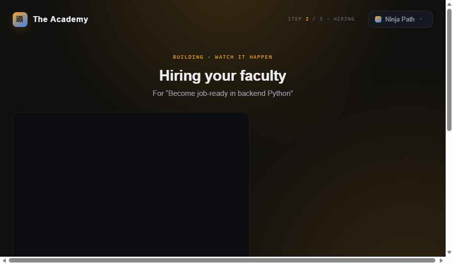

# AULA — Your Virtual AI College

An AI-run college where a faculty of specialized agents designs your curriculum,
teaches it, examines you, and adapts to how you actually learn. You tell the
Principal what you want to learn; it hires a faculty, builds your semester, and
runs the whole institution — you just enrol and study.

This repo currently contains a **fully interactive front-end prototype** of the
product, plus the **architecture design** for the system it's meant to become.



## The idea

A real college is a set of roles working together. AULA models each as an agent:

| Agent | Role |
| --- | --- |
| **Principal** (Orchestrator) | Reads your goal, hires the faculty, designs the college |
| **Provost** | Owns teaching *methodology* — rewrites a professor's approach when results dip |
| **Professors** | One per subject; author lessons, set tasks, mentor you |
| **Examiner** | Sets and grades exams against a bar |
| **Registrar** | Attendance, records, streaks |
| **Personal Guide** | Always-on; routes any question to the right professor |
| **Counselor** | Pacing, nudges, wellbeing |

The twist: **professors are graded, not just students.** When you fail an exam,
that's a negative signal to the *teacher* — the Provost rewrites their
methodology (e.g. "worked examples before theory") and they re-teach. The
Command Center shows this reward feedback loop live.

Everything reskins instantly across 10 genre-inspired **themes** (Ninja,
Blade, Spirit, Hero, Voyage, Arcane, Mecha, Cyber, Dream + Standard) — the
whole vocabulary (Principal→Headmaster, Exam→Rank Trial, etc.) changes with it.

## Run the prototype

The app is **React frontend + Python (FastAPI) backend**. The frontend runs
standalone in demo mode; connect the backend to make the agents real.

### 1. Frontend (always works, demo data)

```bash
# from the repo root — use any port EXCEPT 8000 (the backend's port)
python3 -m http.server 5173
# then open http://localhost:5173
```

Describe a learning goal, watch the faculty get hired, review the plan, and
enrol. (State persists in `localStorage`; clear it to replay onboarding.)

> Open it through a server, not `file://` — the app loads its JSX modules over HTTP.

### 2. Backend (makes the AI real)

```bash
cd backend
./run.sh            # creates a venv, installs deps, serves on http://localhost:8000
```

Then open the frontend's **Connections** screen, pick a provider
(**Claude · OpenAI · Groq · Ollama**), paste your API key, **Test**, and
**Connect**. From then on the Principal designs your curriculum with a real
model, choosing topic-appropriate sandboxes per subject. No key? It stays in
demo mode and still works end to end.

### Accounts & persistence

The backend is **multi-user**. Create an account (or "continue as guest") from
the sign-in dialog — your enrollment, faculty/reward state, and progress are
saved per user in SQLite (`backend/aula.db`, git-ignored) and restored on your
next visit. Each user's connector + key, college, and progress are isolated.

## Bring your own model (connectors)

The agents are model-agnostic. You choose the provider and supply your own key
in the UI — nothing is hard-coded:

| Provider | Notes |
| --- | --- |
| **Claude (Anthropic)** | Official `anthropic` SDK, adaptive thinking. `claude-opus-4-8` default. |
| **OpenAI (GPT)** | Official `openai` SDK. |
| **Groq** | OpenAI-compatible — very fast inference. |
| **Ollama** | OpenAI-compatible, runs locally — no key, fully private. |

Your key is saved on *your* backend (in `backend/aula.db`, per user, git-ignored)
and used to call the provider. It never lands in the repo.

## Layout

```
index.html              Entry point — loads React + Babel and the app modules
app/
  theme.js              10 themes + CSS-variable theming engine
  data.js               Demo scenario (learning backend Python)
  api.js                Backend client + curriculum adapter
  ui.jsx                Shared primitives (Avatar, Bar, Spark, Icon, RankRing)
  app.jsx               App shell: sidebar nav, topbar, routing, theme switch
  screens_onboard.jsx   Intake → Hiring → Review enrolment flow (calls the Principal)
  screens_learn.jsx     Dashboard, Curriculum, Board, Lesson, Guide, Channel, Library, Progress
  screens_admin.jsx     Exams, Faculty Grades, Teacher Board, Command Center, Connections
  app.css, screens.css  Styling
backend/
  app/main.py           FastAPI app (CORS + routers, DB init on startup)
  app/db.py, repo.py    SQLite persistence + per-user state access
  app/auth.py           Accounts (PBKDF2 + bearer tokens), guest fallback
  app/llm/              Provider-agnostic LLM layer (Claude/OpenAI/Groq/Ollama + demo mock)
  app/state.py          Per-user faculty grades, methodology versions, reward feed
  app/progress.py       The student model (per-concept mastery, XP, streak)
  app/agents/           Principal (curriculum), Professor (lessons), Examiner (grading)
  app/sandbox/          Real execution: Python subprocess + SQLite
  app/routers/          auth · connectors · onboard · faculty · sandbox · progress
  run.sh, requirements.txt, .env.example
docs/
  architecture/         System design: component & subsystem specs, architecture map
  screenshots/          Reference captures of the prototype
```

## Status & roadmap

The product is taking shape. Done so far, and what's next:

- [x] **Pluggable LLM connectors** — pick Claude/OpenAI/Groq/Ollama, bring your key
- [x] **Real Principal orchestration** — intake → live curriculum generation
- [x] **Topic/semester-driven sandboxes** — the Principal mounts the right
      environment per subject (SQL, Git, web search, Jupyter, shell…), not just Python
- [x] **Professor agents** — author a lesson on demand (with a runnable code cell)
- [x] **Examiner + reward loop** — grades your answer, rewards the *professor*
      (not you); a failure triggers the **Provost** to rewrite their methodology
- [x] **Real sandbox execution** — Python (isolated subprocess) and SQL (SQLite)
      run live from the lesson; the Command Center shows the reward feed update
- [x] **Persistent student model & progress diagnostics** — per-concept mastery,
      XP, and streak update as you learn; the My Progress screen reads it live
- [x] **Accounts + multi-user storage** — register/login (or guest), with each
      user's connector, college, faculty state, and progress isolated in SQLite
- [ ] Hardened sandbox isolation (container/network) for untrusted code
- [ ] Exams as full assessments (the Examiner sets, not just grades, exams)

> ⚠️ The Python sandbox runs code in a subprocess with CPU/memory/time limits —
> fine for local single-user dev, **not** a hardened multi-tenant boundary. Don't
> expose it to the public internet without real container/network isolation.

See `docs/architecture/Architecture Index.html` for the full design.
